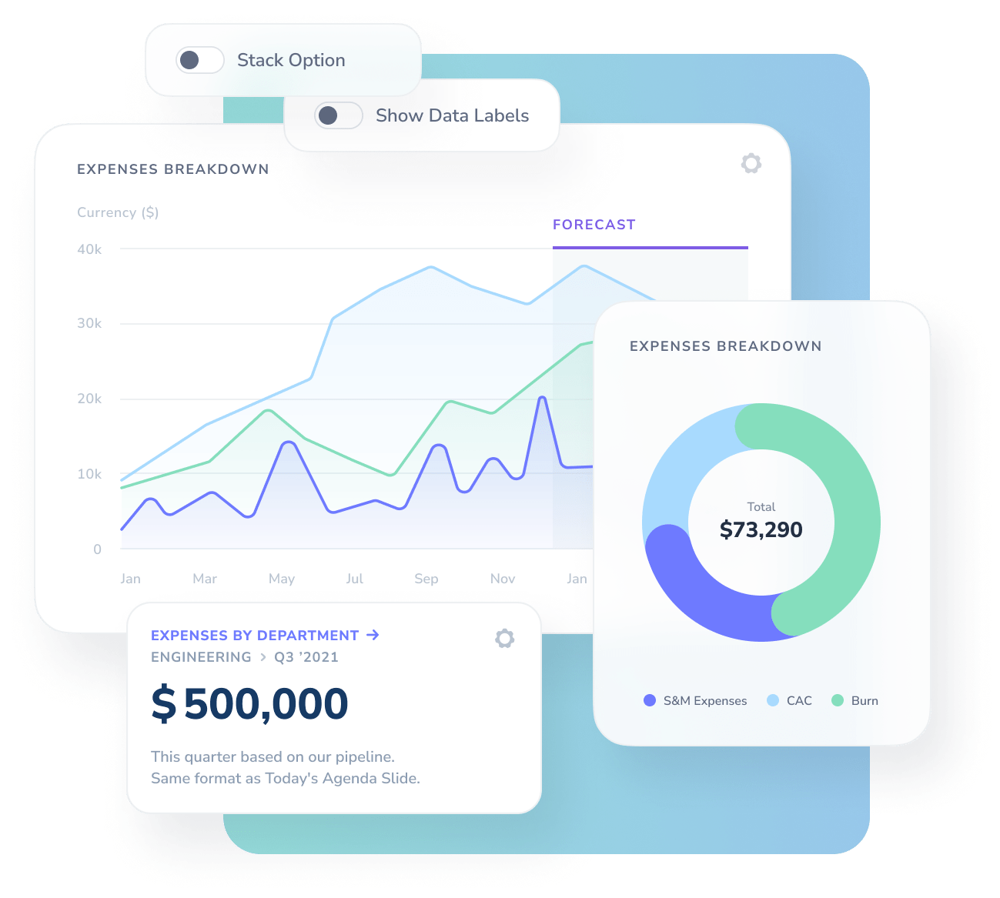
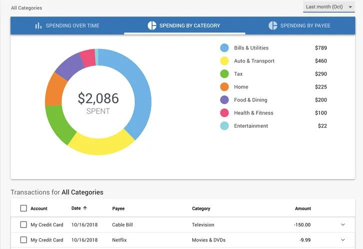

# Project Name: Business Requirement Document (BRD) for CashBuddy

**Authors and Responsibilities:**

- Haicha NIANG:

  - 3.1 Background
    In light of the current challenges posed by price inflation, many individuals are encountering difficulties in preserving their finances for future endeavors. The burden of financial responsibilities often impedes their ability to save, and even when they do succeed, unforeseen expenditures invariably arise. Whether these expenditures are essential or discretionary, the mere presence of readily accessible funds in their accounts or wallets makes it increasingly tempting to utilize them, thereby creating obstacles to savings.

To address this issue, we are committed to offering an application designed to assist individuals in managing their financial reserves on a monthly or ad-hoc basis. This application will facilitate the creation of a separate savings account, directly linked to their primary account, where users can securely deposit their savings at their discretion. Moreover, our application will offer the convenience of automated savings, allowing users to designate a predetermined amount to be systematically transferred from their primary account to their savings account each month.

The envisioned application will incorporate distinct categories, enabling users to differentiate and allocate their savings for specific purposes. This segmentation will empower users to distinguish their emergency fund from funds designated for, say, home construction or other particular financial goals. In doing so, they can precisely track and manage their financial objectives with greater ease and clarity.

Furthermore, our application will feature a comprehensive tracking mechanism, presenting users with graphical representations, such as charts, to provide a visual and insightful overview of their savings frequency and progress. This visual representation will not only enhance transparency but also offer a clear and motivating insight into their savings journey.

- 4.1 Business Process Overview
- 5.1.1 Customer Experience

- Moustapha I. BA:

  - 3.4 Scope of this Project
  - 4.3 Data Requirements
  - 5.2 Shelf Life

- Rokhaya DIAGNE:

  - 1.2 Associated Documents
  - 3.2 Objectives of this Project
  - 5.3 Security Requirements

- Jonathan M. NDAO:

  - 1.1 Amendment History
  - 4.4 MI Reporting Requirements
  - 5.1 Volume Model
  - 5.6 Compliance
  - 5.7 System Operations

- Serigne Ahmadou Mbacke Fall:

  - 1.5 Glossary of Terms
  - 3.3 Known Business Rules
  - 5.4 Constraints

- Voluntary Contributors:
  - 5.6.2 Legal

**Version Number:** 0  
**Status:** In Progress  
**Date:** 2023-10-25

## Document Control

### 1.1 Amendment History

| Version | Date       | Author(s)        | Description of Change |
| ------- | ---------- | ---------------- | --------------------- |
| 0       | 2023-11-01 | Jonathan M. NDAO | Initial Draft         |
| 1       | 2023-11-08 | Jonathan M. NDAO | MI Reporting          |
| 2       | 2023-11-15 | Jonathan M. NDAO | Volume Model          |

### 1.2 Associated Documents

- List any documents related to this project, such as reference materials or supporting documentation.

### 1.3 Review List

- Specify the individuals or teams responsible for reviewing and providing feedback on this document.

### 1.4 Additional Distribution List

- Identify the stakeholders or teams who should receive this document apart from the core team.

### 1.5 Glossary of Terms

- Transfer: The action of moving funds from one user's account to another within the mobile cash app.
- Recipient: The user who receives funds in a money transfer transaction.
- Sender: The user who initiates and sends money in a transfer transaction.
- Transaction Fee: The charge or cost associated with using the app for certain transactions.
- Two-Factor Authentication (2FA): A security method that requires users to provide two forms of identification to access their accounts, enhancing security.
- Balance: The amount of money in a user's account at any given time.
## Purpose of this Document

- Provide a brief overview of the purpose of this document and its importance in the project.

## Introduction

### 3.1 Background

- Present the background and context of the project, including the business problem or opportunity that initiated it.

### 3.2 Objectives of this Project

- Clearly state the objectives and expected outcomes of the project to set the stage for the requirements.

### 3.3 Known Business Rules

- AML/CFT Regulations: The mobile cash app must comply with Anti-Money Laundering (AML) and Countering the Financing of Terrorism (CFT) regulations, including customer identification and reporting suspicious transactions.
- Daily Transaction Limit: The app enforces a daily transaction limit for users to prevent fraudulent or excessive transactions.
- Transaction Verification: Before completing a transfer, users must verify the transaction with a secure method (e.g., PIN, fingerprint, or facial recognition).
- User Authentication: All users must complete identity verification when registering for the app to ensure the security of financial transactions.
- Fraud Detection: The app includes fraud detection algorithms to identify and block suspicious or potentially fraudulent transactions.
- Cross-Border Transfers: International money transfers are subject to currency conversion rates and may incur additional fees.
### 3.4 Scope of this Project

- Define the boundaries and limitations of the project to provide a clear understanding of what's included.

### 3.5 Exclusions from Scope

- Identify aspects that are deliberately excluded from the project scope.

## Business Requirements

### 4.1 Business Process Overview

Getting started with app development can reveal an impressive number of development options. But with the right app development process, it's much easier. Our development process will involve agile methodology.

Agile methodologies allow teams to work on project phases simultaneously and within short deadlines. Additionally, being agile gives you the flexibility to change direction at short notice or experiment with new approaches.Finally, agile methodologies encourages early ROI through iterative and collaborative project management.

Here are the steps we will go through :

## Pre-launch :

The pre-launch phase aims to identify the main concept and purpose of the application. It is important to get this step right because it determines the success of the project. It starts with a clear vision of the application and its functionalities. Teams must do a lot of research and design preparation at this crucial stage.

Developers should also review the UI/UX during this time, with the ideal outcome being the production of a prototype. Designing a prototype that provides excellent user experience should be the top priority in app development. But a prototype can also make the application more efficient by maximizing its acceptance and use. Both data suggest that user testing (UT) should be a key part of the pre-launch stage to ensure success.

## Frontend Development:

The second phase of the app development stages is frontend development. This differs from UI/UX in the way front-end developers work on an app's functionality. Transforming UX or UI designs into code is the main goal here. Developers therefore need to ensure that interface elements lead users to the intended locations and that data is stored for processing.

During the front-end development phase, developers review all designs, architectures and interfaces, including payment gateways. They can also speed up development with reusable codes. In this step it will also be necessary to decide which of the following elements could be most appropriate to the needs:

-Native: Is the process of building apps for a specific operating system like Android and iOS. Each OS has a specific design language, integrated development environment, and guidelines.

-Hybrid or Cross-Platform Functionality: Hybrid app development involves using web languages such as CSS, HTML, and JavaScript to code applications that are then run in a native shell with an integrated web browser. By taking this approach, developers can share backend code, allowing them to build apps quickly and affordably for multiple platforms.This is often favored by startups who prefer the reduction in time and cost.

When choosing the right type of app development approach, developers will consider many aspects of the prototype or pre-launch phase. These may include degrees of personalization, security or authentication, social media integration, application speed, customer service support and responsiveness levels.

## Backend Development:

This is the opposite side of frontend app development. This is where the final stage of application development takes place. Its role is to support the creation of system architecture, databases, servers, application programming interfaces (APIs), security, and several other background processes. To do this, it defines the fundamental code that allows the application to process actions from the frontend.

Additionally, security and functionality are two areas that developers will focus on during this phase. And since iteration is an important part of the development process, it's important to note the differences between the first version and the final version. If application priorities change, developers working with Agile methodologies can benefit from exchanging features during each development iteration.

## Post-Launch :

The post-launch phase serves as a bookend to all stages of application development. It is a critical and sometimes overlooked aspect of the application development process, defined by supporting, monitoring and maintaining the application to ensure its relevance and proper functioning. Additionally, application security is essential and requires attention from application developers to support the discovery of bugs and code errors before release.

Mobile app users are likely to lose interest or disengage if they have trouble navigating an app. Thus, performing quality assurance testing, user acceptance testing (UAT), and test-driven development (TDD) is vital at this stage of the application development process.

Once testing is complete, deployment can begin.

### 4.2 Detailed Business Requirements

- Elaborate on the specific business requirements, detailing what needs to be achieved.

### 4.3 Data Requirements

To support the business processes and requirements of our app. we will need various types of data. Here's a breakdown of the essential data elements:

#### 4.3.1 User Data
- **User profiles**: Name, email. username, profile picture, address
- **Authentification data**: Encrypted passwords, security questions, two-factor authentication settings.
- **Financial goals and preferences**: saving goals, investments preferences

Theses provide the data we need to display right information on the page depending on the user.

#### 4.3.2 Financial Account Data
- **Bank and financial institution account information**: account numbers, account names, financial institution names
- **Transaction data**: transaction data, transaction amount, description, category, payment method.
- **Balances**: Current account balances

Theses allows to link the financial account with the app so that the user may transfert money from his bank account to the app.

#### 4.3.3 Budget and Expense Data
- **Budget details**: budget name, start date, end date, total budget amount
- **Expense data**: Date, amount, category, payee, notes, receipts
- **Budget tracking**: Expenses allocated to budgets, remaining budget amount.

#### 4.3.4 Goal Data
- **Financial goals**: goal name, target amount, target date, category.
- **Goal tracking**: Progress towards goals, contributions made

#### 4.3.5 Security and Authentication Data
- **User authentication logs**: login and logout times, IP addresses, device information
- **Security event logs**: failed login attempts, password change history

#### 4.3.6 Notification and Communication Data:
- **Notification preferences**: user settings for receiving alerts, reminders, and notifications.
- **In-app messages**: communication history with users, including messages sent and received.

#### 4.3.7 Third-Party Data
- **Data from third-party services**: payment transaction data, credit scores, investment portfolio details

#### 4.3.8 Localization Data
- **Language preferences**: user-selected language for app interface and content
- **Regional preferences**: user-selected currency, date format, time zone.

#### 4.3.9 App Usage Data
- **User interactions**: user activity within the app, such as clicks, page views, and feature usage.
- **Analytics data**: user engagement metrics, app performance, and error logs.

Theses help to know where to place adds for instance.

#### 4.3.10 Historical Data
- **Historical transaction and account data**: transaction history, past account balances
- **Historical budget and expense data**: Past budgets, expenses, and their associated data

Theses might help the user to compare his expenses.

#### 4.3.11 Legal and Compliance Data
- **User consent records**: records of users accepting terms of use and privacy policies
- **Compliance logs**: records of actions taken to ensure compliance with financial regulations.

Knowing the records of users accepting terms of use and privacy policies help the administration of the app to know the number of active users.

#### 4.3.12 Support and Feedback Data
- **User support interactions**: records of user support requests, feedback, and resolutions
- **User feedback**: user suggestions, complaints, and feedback regarding the app's functionality

These data will help to improve the app by giving the user what he wants.

### 4.4 MI Reporting Requirements

The MI Reporting Requirements for CashBuddy are vital for providing users with in-depth insights into their financial activities. Key reporting requirements include:

- **Real-time Income and Expense Tracking**: Users should be able to track their income and expenses in real-time. This includes categorizing and subcategorizing expenses for detailed analysis.

- **Goal-setting and Progress Tracking**: CashBuddy will allow users to set financial goals, such as building an emergency fund or saving for a specific purchase. Users can track their progress towards these goals and receive notifications when milestones are reached.

- **Budgeting and Forecasting**: CashBuddy will provide budgeting and forecasting features to help users plan their finances. Users can set budgets for different categories and receive alerts when they exceed their budget. They can also forecast their income and expenses to plan for the future.

- **Interactive Charts and Visualizations**: To facilitate better financial decision-making, CashBuddy will provide interactive charts and visualizations. These will include pie charts, bar graphs, and line charts to present financial data. Users can customize these visuals to gain insights into their spending patterns, income sources, and savings trends.

- **Customizable Reports**: CashBuddy will allow users to create custom reports based on their financial data. These reports can be exported in various formats, including PDF, CSV, and Excel.

<table>
  <tr>
 <td></td>    
 <td></td>
  </tr>
</table>

## Non-Functional Requirements

### 5.1 Volume Model

To ensure the optimal performance of CashBuddy, it's crucial to address the expected volume of data and user transactions. CashBuddy aims to support a large user base and handle significant financial data.

Specific volume-related considerations include:

- **Supporting Thousands of Concurrent Users**: CashBuddy is designed to accommodate a substantial user base. It should be capable of handling thousands of concurrent users without performance degradation.

- **Efficient Processing of High Transaction Volumes**: Given the financial nature of the application, it's essential to efficiently process a high volume of financial transactions, including income, expenses, and transfers. The system should provide rapid and accurate transaction processing.

- **Scalability**: CashBuddy should be designed with scalability in mind. As the user base grows, the system should seamlessly scale to handle the increased load while maintaining a responsive user experience.

- **Data Storage**: CashBuddy will store a large volume of financial data, including user information, transaction records, and financial reports. The system should be capable of storing and retrieving this data efficiently.

- **Data Backup and Recovery**: To protect user data, CashBuddy will implement robust data backup and recovery mechanisms. This will ensure that user data is not lost in case of unexpected events or data corruption.

- **Data Retention**: CashBuddy will retain user data for a specified period. This will allow users to access their financial records and reports at any time.

- **Data Archiving**: CashBuddy will archive user data after a specified period. This will ensure that the system's performance is not impacted by the volume of data stored.

**Estimations for a Volume Model**

If we assume that CashBuddy will have 100,000 users, each with an average of 100 transactions per month, the system will handle 10 million transactions per month. This translates to 120 million transactions per year.

If we assume that each transaction will generate 1 KB of data, the system will handle 120 GB of data per year. It's important to note that this estimation is based on assumptions and should be refined with more accurate data or research.

These estimations serve as a starting point for infrastructure planning. CashBuddy will require a robust infrastructure with sufficient storage, processing power, and scalability mechanisms to handle the expected data and transaction volumes.

#### 5.1.1 Customer Experience

- Detail the non-functional requirements related to ensuring an exceptional customer experience.

### 5.2 Shelf Life

#### 5.2.1 Data Retention Policies
This is the policies that specify how long different types of data will be stored within the app.
- **Transaction data**, **historical budget** and **expense data** may be retained for a **minimum of 6 weeks** and a **maximum of 8 weeks**.
- User login history may be retained for **2 weeks**

#### 5.2.2 User Data Control
Users should have the ability to control and customize data retention preferences, allowing them to:
- Delete **specific transactions** and **data entries**
- **Archive** or **export data** for personal record-keeping
- Set their own retention preferences for historical data

#### 5.2.3 Automated Data Deletion
The app should have an automated data deletion processes that adhere to the defined data relation policies. Therefore, ensure that:
- Data **older** than the specified retention periods is automatically deleted,
- Deleted data is **irretrievable** and **securely erased**

#### 5.2.4 Data Export and Backup
Users should be **allowed to export their data**, such as transaction history, budgets, and expense reports, for backup purpose.
This functionality should **be accessible to users at any time**.

#### 5.2.5 User Notifications
The app **should notify users** in advance before any data is set to expire or be automatically deleted according to the retention policies.
Users should receive clear and informative notifications about upcoming data removal.

#### 5.2.6 Account Closure
Users should **be able to close their accounts**. Therefore, the app should ensure that user data is deleted.

#### 5.2.7 Data Backups
The app should have a **robust data backup plan** to protect user data in case of system failures.

### 5.3 Security Requirements

- Outline the security measures and requirements to protect sensitive information.

### 5.4 Constraints

- Budget Constraints: The project operates with a predefined budget for development and maintenance, limiting the allocation of resources.
- Compliance Deadlines: The app must meet regulatory compliance deadlines, and any delays can result in legal consequences.
- Third-Party Integration: The integration of external payment systems and financial institutions may be subject to their operational constraints and APIs.
- Scalability: The app's infrastructure must support scalability to accommodate increased user activity and transaction volumes.
- Security and Data Protection: Strict security measures and encryption must be implemented to protect user data and prevent data breaches.
- User Support and Response Times: The app must adhere to specific response time constraints for addressing user support requests and resolving issues.
#### 5.5 Integrity

- Address the integrity and reliability of data, processes, and systems.

##### 5.5.1 Robustness

- Define the robustness requirements for the system's stability and resilience.

### 5.6 Compliance

- Ensure that the project adheres to relevant industry standards and regulations.

#### 5.6.1 Auditing

- Define auditing requirements to track and monitor compliance.

#### 5.6.2 Legal

- Specify legal requirements and considerations for the project.

#### 5.6.3 Internationalization

- Address internationalization requirements for global reach and adaptability.

### 5.7 System Operations

- Detail the requirements for system operations, including maintenance and support.

## Key Working Assumptions

- Enumerate any assumptions made during the project, which can impact the requirements or deliverables.
